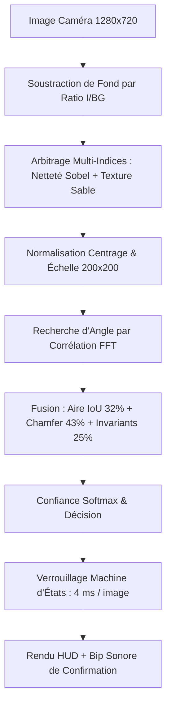

# PartVision — Identification Temps Réel de Noyaux de Robinet

Système de vision industrielle 2D pour la détection et la classification en temps réel de **noyaux de robinet en sable** (4 types).

Fonctionne **sans GPU**, **sans dataset lourd** et **sans réseau de neurones** : une simple caméra USB (LifeCam HD-3000), un processeur standard (CPU), et des algorithmes déterministes de vision géométrique et morphologique.

---

## 1. Vue d'ensemble du projet

Sur un poste d'assemblage ou de contrôle, un opérateur pose un noyau sur la table de travail :
1. **Acquisition & Détection :** La caméra capture la scène. Le système isole la pièce du fond même en présence d'ombres et de reflets spéculaires intenses.
2. **Identification Géométrique :** La silhouette est normalisée en position et échelle. L'angle de rotation est calculé instantanément par corrélation FFT, et la pièce est comparée aux références (superposition d'aire + distance de contour fine de Chamfer).
3. **Affichage HUD & Signal Sonore :** Le type de la pièce (`TYPE 1`, `TYPE 2`, `TYPE 3`, `TYPE 4`) s'affiche en grand avec un code couleur contrasté et une jauge de confiance. Un **bip sonore** retentit dès que la mesure est stabilisée.
4. **Verrouillage CPU :** Une fois la pièce identifiée, le système se verrouille (4 ms par image) pour économiser les ressources et éviter tout clignotement.

---

## 2. Structure des fichiers

Le projet est épuré et contient uniquement les fichiers nécessaires à l'exploitation et à la maintenance :

| Fichier / Répertoire | Rôle |
|---|---|
| **`live.py`** | Application principale : flux vidéo temps réel, gestion du fond, classification et affichage HUD. |
| **`part_classifier.py`** | Moteur de classification : extraction de signature, alignement FFT, distance de Chamfer, moments de Hu. |
| **`segmentation.py`** | Moteur de traitement d'image : extraction de masque robuste aux reflets, fond adaptatif et arbitrage multi-critères. |
| **`hud.py`** | Rendu graphique OpenCV : badges de type, jauge de confiance, halo lumineux et panneaux translucides. |
| **`enroll.py`** | Outil d'apprentissage/enrôlement : crée ou met à jour `model.npz` (en direct ou via photos). |
| **`check_camera.py`** | Outil de diagnostic : détection de l'index de la caméra USB et réglage du cadrage. |
| **`model.npz`** | Modèle compact contenant les signatures des poses de référence (32 poses enrôlées pour les 4 types). |
| **`model_refs.png`** | Planche visuelle de contrôle montrant les silhouettes enregistrées dans `model.npz`. |
| **`refs/`** | Dossier contenant les photos de référence réelles et images de fond associées. |
| **`zone.json`** | *(Généré automatiquement)* Coordonnées de la zone de travail définie par l'utilisateur. |

---

## 3. Comment fonctionne le système (Pipeline technique)



### A. La segmentation robuste à l'éclairage (`segmentation.py`)
Sur une table réfléchissante, un reflet de lumière chaude a la même couleur beige et la même intensité que la pièce en sable. Deux mécanismes résolvent ce problème :
* **Modèle de fond adaptatif par ratio :** Le système calcule le rapport $\frac{\text{Image}}{\text{Fond}}$ plutôt qu'une simple différence. Le fond s'auto-rafraîchit en continu quand la scène est vide pour absorber les dérives lumineuses lentes de l'atelier.
* **Critères discriminants physiques :** Le reflet est lisse avec des bords flous, alors que la pièce a des **bords très nets** (fort gradient Sobel) et une **texture rugueuse** (variance locale de l'intensité $\sigma / \mu$).

### B. Normalisation géométrique (`part_classifier.py`)
* Le centre de gravité (barycentre) est recalculé pour recentrer la pièce au centre d'un canevas standardisé de $200 \times 200$ pixels.
* La taille est mise à l'échelle selon $\sqrt{\text{Aire}}$, ce qui rend la reconnaissance **invariante à la position et aux variations de hauteur de la caméra**.

### C. Alignement de rotation par corrélation FFT
* Une signature radiale sur 256 rayons (distance centre-contour selon l'angle $\theta$) est extraite.
* Faire tourner la pièce correspond à un décalage circulaire de ce vecteur.
* La corrélation croisée par **Transformée de Fourier Rapide (`np.fft.rfft`)** donne l'angle exact en un temps de calcul infime ($O(N \log N)$), sans balayage angulaire itératif.

### D. Séparation des sosies (Type 1 vs Type 4) via la distance de Chamfer
Le Type 1 (cylindre) et le Type 4 (cylindre avec ergot) ont presque la même surface : l'IoU seul ne suffit pas.
* **Distance de contour de Chamfer (`cv2.distanceTransform`) :** Mesure la distance point à point entre les deux contours. Dès qu'un ergot manque ou apparaît, la distance de Chamfer sanctionne immédiatement le score.
* **Pondération finale :**
  - **$43\,\%$** : Similarité de contour de Chamfer
  - **$32\,\%$** : Recouvrement d'aire (IoU)
  - **$25\,\%$** : Descripteurs invariants (24 harmoniques de Fourier + 7 moments de Hu + 6 ratios géométriques)

### E. Optimisation par verrouillage d'état (4 ms)
* Cycle à trois états : `VIDE` $\rightarrow$ `MESURE` $\rightarrow$ `VERROUILLÉ`.
* Dès qu'une pièce est validée, le résultat se verrouille. En mode verrouillé, le système cesse d'exécuter la segmentation lourde : il compare une vignette miniature ($96 \times 72$ px) de la scène actuelle à celle de référence.
* Le temps par image chute de **500 ms à 4 ms** (gain $\times 125$). Le processeur reste froid et l'affichage est parfaitement stable sans scintillement.

---

## 4. Guide d'utilisation

### Étape 1 : Vérifier la caméra et le cadrage
Localisez l'index de votre caméra USB (souvent l'index `2` pour une LifeCam externe sous Linux) :
```bash
python3 check_camera.py
```
Affichez le retour vidéo pour régler la hauteur et la mise au point :
```bash
python3 check_camera.py --show 2
```
*Appuyez sur `q` pour fermer la fenêtre de prévisualisation.*

---

### Étape 2 : Lancer la détection en direct
Lancez le programme principal :
```bash
python3 live.py --model model.npz --camera 2
```

#### Raccourcis clavier disponibles pendant l'exécution :
| Touche | Action |
|:---:|---|
| **`b`** | **Calibrer le fond** (à faire scène vide au lancement). |
| **`z`** | **Définir la zone de travail** : tracez un rectangle à la souris et validez avec `Entrée`. Tout ce qui est hors zone est ignoré. |
| **`c`** | Effacer la zone de travail. |
| **`d`** | Afficher / masquer le **détail des scores** des 4 types. |
| **`r`** | **Forcer une nouvelle mesure** (déverrouille la décision courante). |
| **`m`** | Activer / couper le bip sonore. |
| **`s`** | Enregistrer une capture d'écran instantanée. |
| **`+` / `-`** | Ajuster le seuil de confiance minimal. |
| **`q`** | Quitter l'application. |

---

### Étape 3 : Enrôler de nouvelles pièces ou de nouvelles poses (`enroll.py`)

Une pièce 3D posée sur une face différente présente une silhouette différente. Chaque face stable peut être enregistrée sous le même numéro de type.

#### En direct avec la caméra (recommandé) :
```bash
python3 enroll.py --live --camera 2 --out model.npz
```
1. Laissez la table vide et appuyez sur **`b`** pour calibrer le fond.
2. Posez la pièce sous la caméra.
3. Appuyez sur le chiffre correspondant (**`1`**, **`2`**, **`3`** ou **`4`**).
4. Retournez la pièce sur une autre face et réappuyez sur le **même chiffre** pour ajouter cette pose.
5. Appuyez sur **`s`** pour enregistrer `model.npz`, puis **`q`** pour quitter.
6. Vérifiez le fichier image `model_refs.png` généré pour valider les silhouettes enregistrées.

#### À partir d'un dossier de photos :
```bash
python3 enroll.py --images refs/ --out model.npz
```

---

## 5. Recommandations d'installation industrielle

Pour garantir un taux de reconnaissance maximal :

1. **Surface de travail mate :** Utilisez un tapis ou une feuille noire/grise **mate** sous la pièce. Cela élimine 90 % des reflets spéculaires à la source.
2. **Résolution 1280×720 :** Le calcul de la texture granulaire du sable est optimal en 720p. Évitez le 640×480.
3. **Éclairage homogène et diffus :** Privilégiez un plafonnier ou un éclairage diffus plutôt qu'une lampe de bureau ponctuelle et rasante qui crée des ombres dures.
4. **Délimiter la zone de travail (`z`) :** Si le champ de vision de la caméra englobe le sol, des câbles ou les mains de l'opérateur, appuyez sur `z` et tracez un cadre autour du plan de pose.
5. **Désactiver l'exposition automatique (Linux) :** Pour verrouiller les réglages capteur de la LifeCam :
   ```bash
   v4l2-ctl -d /dev/video2 -c exposure_auto=1 -c exposure_absolute=200
   ```

---

## 6. Dépannage rapide

* **La pièce est indiquée `INDETERMINE` alors qu'elle est bien détourée :**
  Il s'agit probablement d'une face ou orientation qui n'a pas encore été enrôlée. Activez les détails avec `d` pour observer les scores, puis ajoutez cette pose dans `enroll.py`.
* **Le contour clignote ou accroche un reflet :**
  Vérifiez que la scène est vide et appuyez sur `b` pour recalibrer le fond.
* **Une pièce n'est pas détectée du tout :**
  Assurez-vous qu'elle ne touche pas les bords de l'image ou de la zone de travail (les pièces coupées par le cadre sont volontairement ignorées pour éviter les fausses mesures).

---

## 7. Intégration Python (Exemple minimal)

Pour réutiliser le moteur dans un autre script Python :

```python
import cv2
import segmentation as S
from part_classifier import PartClassifier, signature_from_mask

# Charger le modèle
clf = PartClassifier.load("model.npz")

# Charger une image et l'image du fond vide
frame = cv2.imread("piece.jpg")
bg = cv2.imread("fond_vide.jpg")

# Extraction du contour
mask, cnt = S.segment(frame, background=bg)

if cnt is not None:
    # Classification
    sig = signature_from_mask(mask, cnt)
    res = clf.classify_signature(sig)
    
    print(f"Type détecté : {res['label']}")
    print(f"Confiance     : {res['confidence'] * 100:.1f} %")
    print(f"Angle         : {res['angle']:.1f}°")
```
